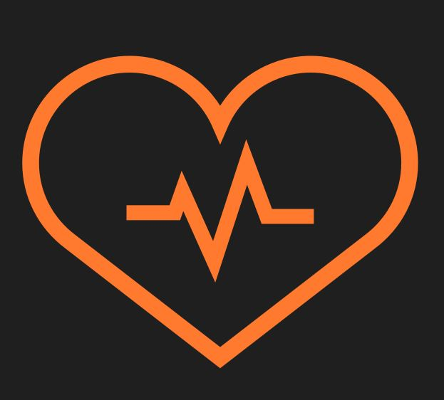

  
  <h1 style="margin: 0;">Fit&Fine</h1>
  

<h2>Welcome</h2>

Link to Fit&Fine React Frontend Live website: [CLICK HERE!](https://fitandfine-react-p5-f5d23da9d77c.herokuapp.com/)

[Fit&Fine Django Rest Framework API Backend Live Link](https://fitandfine-drf-be560b223a3b.herokuapp.com/)

[Fit&Fine React Backend Github Repo](https://github.com/SwathiKeshavamurthy/FitandFine-P5)

# Introduction - Fit and Fine

Welcome to Fit and Fine, a comprehensive fitness and wellness platform designed to promote a healthy and active lifestyle. Fit and Fine connects individuals, fitness enthusiasts, and wellness experts, providing tools and resources to help you achieve your health goals. Our platform offers a variety of features to support your fitness journey, including challenge participation, daily routine tracking, and community interaction. Whether you are looking to improve your fitness, track your daily activities, or engage with a supportive community, Fit and Fine is your go-to destination for all things wellness.

Fit and Fine focuses on leveraging the latest web technologies, including React for the frontend and Django for the backend, ensuring a seamless and engaging user experience. It is designed for anyone passionate about fitness, from beginners to advanced athletes.

**Engage In**

Join Fit and Fine today and become part of a community dedicated to health and wellness. Whether you’re here to set new fitness goals, track your progress, or engage with others who share your passion, we welcome you to our platform. Let's embark on this fitness journey together and achieve a healthier, happier life!

# Table of Contents- [Introduction](#introduction)
- [Introduction - Fit and Fine](#introduction---fit-and-fine)
- [Table of Contents- Introduction](#table-of-contents--introduction)
- [UX Experience](#ux-experience)
  - [Key Features](#key-features)
  - [User Goals](#user-goals)
  - [Planning](#planning)
  - [User Journey](#user-journey)
- [Design](#design)
  - [Colors](#colors)
  - [Fonts](#fonts)
    - [Logo and Branding](#logo-and-branding)

# UX Experience

## Key Features

Fit and Fine offers a range of features to help you stay motivated and connected on your wellness journey, including:

- **User Authentication:** Sign up, log in, and manage your profile with ease.
- **Profile Management:** Customize your profile, including personal information and profile picture.
- **Challenge Participation:** Join and create fitness challenges, track your progress, and stay motivated.
- **Daily Routine Tracking:** Log your daily activities, including meals, workouts, and water intake.
- **Community Interaction:** Share updates through - post content, like, and comment on posts within the community.
- **Responsive Design:** Access the platform from any device, whether it's a desktop, tablet, or mobile phone.
- **Resource Hub:** Access a curated selection of fitness and wellness resources, guides, and articles.
- **User Contributions:** Registered users can contribute their own posts, share their fitness journeys, and add to the collective knowledge base of Fit and Fine.
- **About and Collaborate:** Learn more about our mission and vision in the About section, and connect with us through the Collaborate section to share ideas, feedback, or partnership opportunities.
- **Footer:** Navigate easily with our comprehensive footer, which includes links to essential pages, social media channels, and contact information.

## User Goals

- **New Users:** Easily create an account, set up a profile, and start engaging with the community.
- **Returning Users:** Quickly log in, track their fitness progress, participate in challenges, and interact with posts.
- **Community Members:** Comment on posts, like and bookmark favorite content, and follow other users.
- **Fitness Enthusiasts:** Find and join fitness challenges, log daily routines, and track calorie intake and workouts.
- **Contributors:** Create and share new posts related to fitness and wellness.

## Planning

Fit and Fine is designed with a user-centric approach, ensuring that the platform is intuitive and easy to navigate. The key aspects of the design include:

- **Responsive Design:** The platform is fully responsive, providing a seamless experience on desktops, tablets, and mobile devices.
- **Clean and Modern UI:** A clean, modern interface that focuses on usability and aesthetic appeal.
- **Easy Navigation:** Intuitive navigation menus and a well-structured layout to help users find the features they need quickly.
- **Accessibility:** Features like adjustable text sizes, high contrast modes, and screen reader compatibility to ensure the platform is accessible to all users.

## User Journey

1. **Onboarding:** New users are guided through a simple sign-up process, including profile setup and a brief tutorial on using the platform.
2. **Exploration:** Users can explore the platform, discovering challenges, reading posts, and connecting with other users.
3. **Engagement:** Users actively participate by logging their routines, joining challenges, and interacting with the community through comments and likes.
4. **Tracking Progress:** Users can view their progress over time, track their challenge participation, and see improvements in their daily routines and fitness levels.
5. **Contribution:** Experienced users can share their knowledge by creating posts and helping to grow the community.

By focusing on these key aspects of the user experience, Fit and Fine aims to provide a platform that is not only functional but also enjoyable to use, encouraging users to stay active, engaged, and motivated in their fitness journey.

# Design

## Colors

The color palette for Fit and Fine is derived from the logo's gradient shades, which blend from orange to red, representing energy, vitality, and passion. These colors are used consistently throughout the application to create a cohesive and visually appealing design.

  

- **Primary Colors:**
  - **Orange:** Represents energy and enthusiasm. Used for primary buttons and highlights. `#FFA500`
  - **Red:** Symbolizes passion and intensity. Used for alerts and important highlights. `#FF4500`
  
- **Gradient Shades:**
  - **Orange to Red Gradient:** This gradient is used in the logo and various UI elements to create a dynamic and engaging visual effect.

- **Additional Colors:**
  - **White:** Used for backgrounds and text to provide contrast and readability. `#FFFFFF`
  - **Black:** Used for text and icons. `#000000`
  - **Gray:** Used for secondary text and borders. `#808080`

## Fonts

Fit and Fine utilizes two primary fonts from Google Fonts: **Almarai** and **Radio Canada Big**. These fonts are chosen for their readability and modern appearance, which align with the application's theme of fitness and well-being.

- **Almarai:**
  - Used for body text and headings.
  - Font Weights: 300, 400, 700, 800

- **Radio Canada Big:**
  - Used for special headings and emphasized text.
  - Font Weights: 400 to 700 (both italic and normal)

### Logo and Branding

The logo of Fit and Fine, as shown above, combines the primary colors in a gradient effect, providing a strong visual identity for the brand. The heart symbol with a heartbeat line inside emphasizes health and fitness, while the gradient banner below the text "Set. Sweat. Share. Shine." encapsulates the essence of the application's mission.