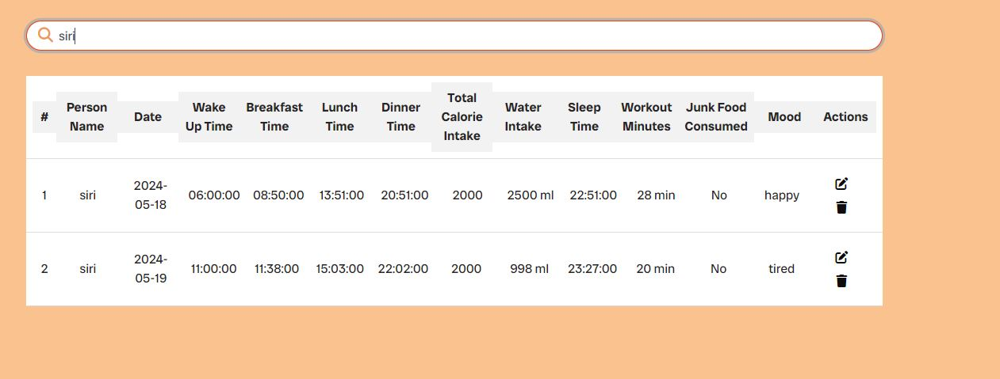

<p align="center">
  
  <span style="font-size: 2em; margin: 0 10px;">Fit&Fine</span>
  
</p>

<h2 style="text-align: center;">Welcome</h2>

Link to Fit&Fine React Frontend Live website: [CLICK HERE!](https://fitandfine-react-p5-f5d23da9d77c.herokuapp.com/)


[Fit&Fine Django Rest Framework API Backend Live Link](https://fitandfine-drf-be560b223a3b.herokuapp.com/)

[Fit&Fine React Backend Github Repo](https://github.com/SwathiKeshavamurthy/FitandFine-P5)

# Introduction - Fit and Fine

Welcome to Fit and Fine, a comprehensive fitness and wellness platform designed to promote a healthy and active lifestyle. Fit and Fine connects individuals, fitness enthusiasts, and wellness experts, providing tools and resources to help you achieve your health goals. Our platform offers a variety of features to support your fitness journey, including challenge participation, daily routine tracking, and community interaction. Whether you are looking to improve your fitness, track your daily activities, or engage with a supportive community, Fit and Fine is your go-to destination for all things wellness.

Fit and Fine focuses on leveraging the latest web technologies, including React for the frontend and Django for the backend, ensuring a seamless and engaging user experience. It is designed for anyone passionate about fitness, from beginners to advanced athletes.

**Engage In**

Join Fit and Fine today and become part of a community dedicated to health and wellness. Whether you’re here to set new fitness goals, track your progress, or engage with others who share your passion, we welcome you to our platform. Let's embark on this fitness journey together and achieve a healthier, happier life!


# Table of Contents
- [Introduction - Fit and Fine](#introduction---fit-and-fine)
- [Table of Contents](#table-of-contents)
- [UX Experience](#ux-experience)
  - [Key Features](#key-features)
  - [User Goals](#user-goals)
  - [Planning](#planning)
  - [User Journey](#user-journey)
- [Design](#design)
  - [Colors](#colors)
  - [Fonts](#fonts)
    - [Logo and Branding](#logo-and-branding)
- [Project Planning](#project-planning)
  - [Strategy Plane](#strategy-plane)
  - [Agile Methodologies - Project Management](#agile-methodologies---project-management)
    - [Story Points Allocation](#story-points-allocation)
    - [Sprint Planning](#sprint-planning)
      - [Allocating Story Points to Milestones](#allocating-story-points-to-milestones)
    - [MoSCoW Prioritization](#moscow-prioritization)
    - [User Stories, Milestones, and Epics](#user-stories-milestones-and-epics)
      - [User Stories](#user-stories)
      - [Milestones](#milestones)
      - [Epics](#epics)
  - [Scope Plane](#scope-plane)
    - [Features and Functionalities:](#features-and-functionalities)
  - [Structural Plane](#structural-plane)
    - [Information Architecture:](#information-architecture)
      - [Navigation Structure:](#navigation-structure)
- [Skeleton \& Surface Planes](#skeleton--surface-planes)
  - [Wireframes](#wireframes)
  - [Database Schema - Entity Relationship Diagram](#database-schema---entity-relationship-diagram)
    - [Database Schema](#database-schema)
    - [Entity Relationship Diagram (ERD)](#entity-relationship-diagram-erd)
    - [Tables Overview](#tables-overview)
    - [Relationships](#relationships)
    - [Design Considerations](#design-considerations)
  - [Security](#security)
    - [Data Encryption](#data-encryption)
    - [CSRF Tokens](#csrf-tokens)
    - [Django AllAuth](#django-allauth)
    - [API Security](#api-security)
- [Features](#features)
  - [Existing Features](#existing-features)
    - [Features Functionality](#features-functionality)
    - [CRUD Functionality](#crud-functionality)
    - [All Existing Features with Screenshots](#all-existing-features-with-screenshots)
      - [Home Page](#home-page)
      - [User Registration, Login](#user-registration-login)
      - [User Profile](#user-profile)
      - [Search Functionality](#search-functionality)
      - [Responsive Navigation Bar](#responsive-navigation-bar)
      - [Challenges Page](#challenges-page)
      - [Add Challenge Page(only for superusers)](#add-challenge-pageonly-for-superusers)
      - [My Challenges Page](#my-challenges-page)
      - [Add Posts](#add-posts)
      - [Comments](#comments)
      - [My Posts](#my-posts)
      - [Add Daily Routines](#add-daily-routines)
      - [My Daily Routines](#my-daily-routines)
      - [My Likes](#my-likes)
      - [My Feeds](#my-feeds)
      - [Footer](#footer)
      - [Error Handling](#error-handling)
  - [Future Features](#future-features)
- [Future Features](#future-features-1)
- [Technology Used](#technology-used)
  - [Frontend](#frontend)
  - [Backend](#backend)
  - [Deployment and Version Control](#deployment-and-version-control)
  - [Development Tools](#development-tools)
  - [Security](#security-1)
  - [Others](#others)
- [Testing \& Validation](#testing--validation)
- [Deployment](#deployment)
  - [Step-by-Step Guide:](#step-by-step-guide)
  - [Additional Configurations](#additional-configurations)
- [Cloning and Forking](#cloning-and-forking)
  - [Cloning the Repository](#cloning-the-repository)
  - [Forking the Repository](#forking-the-repository)
- [Credits](#credits)
  - [Code](#code)
  - [Media](#media)
- [Acknowledgements](#acknowledgements)
  - [Inspiration](#inspiration)
  - [Project Guidance](#project-guidance)
  - [ReadMe Structure](#readme-structure)
  - [Technical Solutions](#technical-solutions)
  - [Personal Thanks](#personal-thanks)


# UX Experience

## Key Features

Fit and Fine offers a range of features to help you stay motivated and connected on your wellness journey, including:

- **User Authentication:** Sign up, log in, and manage your profile with ease.
- **Profile Management:** Customize your profile, including personal information and profile picture.
- **Challenge Participation:** Join and create fitness challenges, track your progress, and stay motivated.
- **Daily Routine Tracking:** Log your daily activities, including meals, workouts, and water intake.
- **Community Interaction:** Share updates through - post content, like, and comment on posts within the community.
- **Responsive Design:** Access the platform from any device, whether it's a desktop, tablet, or mobile phone.
- **Resource Hub:** Access a curated selection of fitness and wellness resources, guides, and articles.
- **User Contributions:** Registered users can contribute their own posts, share their fitness journeys, and add to the collective knowledge base of Fit and Fine.
- **About and Collaborate:** Learn more about our mission and vision in the About section, and connect with us through the Collaborate section to share ideas, feedback, or partnership opportunities.
- **Footer:** Navigate easily with our comprehensive footer, which includes links to essential pages, social media channels, and contact information.

## User Goals

- **New Users:** Easily create an account, set up a profile, and start engaging with the community.
- **Returning Users:** Quickly log in, track their fitness progress, participate in challenges, and interact with posts.
- **Community Members:** Comment on posts, like favorite content, and follow other users.
- **Fitness Enthusiasts:** Find and join fitness challenges, log daily routines, and track calorie intake and workouts.
- **Contributors:** Create and share new posts related to fitness and wellness.

## Planning

Fit and Fine is designed with a user-centric approach, ensuring that the platform is intuitive and easy to navigate. The key aspects of the design include:

- **Responsive Design:** The platform is fully responsive, providing a seamless experience on desktops, tablets, and mobile devices.
- **Clean and Modern UI:** A clean, modern interface that focuses on usability and aesthetic appeal.
- **Easy Navigation:** Intuitive navigation menus and a well-structured layout to help users find the features they need quickly.
- **Accessibility:** Features like adjustable text sizes, high contrast modes, and screen reader compatibility to ensure the platform is accessible to all users.

## User Journey

1. **Onboarding:** New users are guided through a simple sign-up process, including profile setup and a brief tutorial on using the platform.
2. **Exploration:** Users can explore the platform, discovering challenges, reading posts, and connecting with other users.
3. **Engagement:** Users actively participate by logging their routines, joining challenges, and interacting with the community through comments and likes.
4. **Tracking Progress:** Users can view their progress over time, track their challenge participation, and see improvements in their daily routines and fitness levels.
5. **Contribution:** Experienced users can share their knowledge by creating posts and helping to grow the community.

By focusing on these key aspects of the user experience, Fit and Fine aims to provide a platform that is not only functional but also enjoyable to use, encouraging users to stay active, engaged, and motivated in their fitness journey.

# Design

## Colors

The color palette for Fit and Fine is derived from the logo's gradient shades, which blend from orange to red, representing energy, vitality, and passion. These colors are used consistently throughout the application to create a cohesive and visually appealing design.

<p align="center">
  
</p>

- **Primary Colors:**
  - **Orange:** Represents energy and enthusiasm. Used for primary buttons and highlights. `#FFA500`
  - **Red:** Symbolizes passion and intensity. Used for alerts and important highlights. `#FF4500`
  
- **Gradient Shades:**
  - **Orange to Red Gradient:** This gradient is used in the logo and various UI elements to create a dynamic and engaging visual effect.

- **Additional Colors:**
  - **White:** Used for backgrounds and text to provide contrast and readability. `#FFFFFF`
  - **Black:** Used for text and icons. `#000000`
  - **Gray:** Used for secondary text and borders. `#808080`

## Fonts

Fit and Fine utilizes two primary fonts from Google Fonts: **Almarai** and **Radio Canada Big**. These fonts are chosen for their readability and modern appearance, which align with the application's theme of fitness and well-being.

- **Almarai:**
  - Used for body text and headings.
  - Font Weights: 300, 400, 700, 800

- **Radio Canada Big:**
  - Used for special headings and emphasized text.
  - Font Weights: 400 to 700 (both italic and normal)

### Logo and Branding

The logo of Fit and Fine, as shown above, combines the primary colors in a gradient effect, providing a strong visual identity for the brand. The heart symbol with a heartbeat line inside emphasizes health and fitness, while the gradient banner below the text "Set. Sweat. Share. Shine." encapsulates the essence of the application's mission.

# Project Planning

## Strategy Plane

**Project Overview:**  
Fit&Fine is a versatile platform created for fitness enthusiasts to document their journeys, engage in challenges, and monitor their daily routines. Acting as a communal hub, it allows users to interact, inspire each other, and stay dedicated to their fitness objectives. Utilizing the latest web technologies, Fit&Fine provides a smooth user experience on all devices.

**Site Goals:**
- Offer a comprehensive resource for fitness enthusiasts to share and discover fitness routines and challenges.
- Cultivate a community where users can connect, motivate, and support one another.
- Ensure a user-friendly interface that is accessible and easy to navigate.
- Incorporate scalable features that adapt to technological advancements and user feedback.

**Target Audience:**
- Fitness enthusiasts ranging from beginners to advanced levels.
- Individuals seeking to join fitness challenges and track their daily routines.
- Users interested in sharing their fitness journeys and engaging with a supportive community.

**User Needs:**
- Access to reliable and current fitness routines and challenges.
- Ability to interact with other community members through comments, likes, and follows.
- Tools to track and manage personal fitness goals and routines.

**Features:**
- Comprehensive fitness challenges and daily routines.
- User profiles for personalized experiences and content tracking.
- Community interaction through comments, likes, and follows.
- Notifications for regular updates and new content.

## Agile Methodologies - Project Management

Fit&Fine utilizes Agile project management to ensure iterative development and continuous improvement. GitHub Projects is used to manage tasks and track progress using a Kanban-style board.

### Story Points Allocation

**Story Points Distribution:**
Story points were allocated to each user story to measure the effort and complexity involved. These points aid in estimating the workload and prioritizing tasks effectively.

**Allocation Guidelines:**
- **Must-have Stories**: Essential features critical to the project's operations were assigned the highest priority.
- **Should-have Stories**: Important but non-essential features that enhance the user experience without being crucial to core functionality. The total story points for "Should-have" stories did not exceed 60% of the total points in any sprint.
- **Could-have Stories**: Desired features considered only after completing the "Must-have" and "Should-have" categories.

### Sprint Planning 

#### Allocating Story Points to Milestones
We need to distribute the 380 story points across the milestones, ensuring they fit within 6 weeks. We will adjust the story points to match the 6-week timeline.

**Milestone 1: Project Setup and Initial Framework**
- **Total Story Points:** 40 (completed in the first week)
- **Breakdown:**
  - **Must-have:** 24 points
  - **Should-have:** 16 points

**Milestone 2: Core Backend APIs**
- **Total Story Points:** 60 (completed in the first and second weeks)
- **Breakdown:**
  - **Must-have:** 36 points
  - **Should-have:** 24 points

**Milestone 3: Basic User Interface and Functionality**
- **Total Story Points:** 100 (completed in the second and third weeks)
- **Breakdown:**
  - **Must-have:** 60 points
  - **Should-have:** 40 points

**Milestone 4: Advanced Features and Final Integration**
- **Total Story Points:** 130 (completed in the third, fourth, and fifth weeks)
- **Breakdown:**
  - **Must-have:** 52 points
  - **Should-have:** 65 points
  - **Could-have:** 13 points

**Milestone 5: Testing and Bug Fixes**
- **Total Story Points:** 50 (completed in the fifth and sixth weeks)
- **Breakdown:**
  - **Must-have:** 20 points
  - **Should-have:** 25 points
  - **Could-have:** 5 points

### MoSCoW Prioritization

To effectively manage project scope, Fit&Fine implements the MoSCoW prioritization method:

- **Must Haves**: Core functionalities including user registration/login, posting fitness updates, and participating in challenges.
- **Should Haves**: Enhanced features like profile customization, dynamic navigation updates, and filtering challenges.
- **Could Haves**: Additional functionalities such as modifying or deleting comments and creating comprehensive documentation.
- **Won't Haves**: Features not essential for the initial launch, such as third-party advertising.

### User Stories, Milestones, and Epics

[Fit&Fine Kanban Board Link](https://github.com/users/SwathiKeshavamurthy/projects/10)

[Fit&Fine User Stories Link](https://github.com/SwathiKeshavamurthy/FitandFine-P5/issues?page=2&q=is%3Aissue+is%3Aclosed)

[Fit&Fine Milestones Link](https://github.com/SwathiKeshavamurthy/FitandFine-P5/milestones?state=closed)

[Fit&Fine Frontend GitHub Link](https://github.com/SwathiKeshavamurthy/fitandfine-react-p5)

[Fit&Fine Backend GitHub Link](https://github.com/SwathiKeshavamurthy/FitandFine-P5)

#### User Stories

| Title                                      | User Story                                                                                           | MoSCoW Priority  | Milestone                              |
|--------------------------------------------|------------------------------------------------------------------------------------------------------|------------------|----------------------------------------|
| User Registration                          | As a user, I want to register an account so that I can participate in challenges and track my fitness. | MUST HAVE        | Core Backend APIs                      |
| Secure User Login                          | As a user, I want to log in securely so that I can access my personal data and interact with the site. | MUST HAVE        | Core Backend APIs                      |
| User Profile Customization                 | As a user, I want to customize my profile so that I can express myself and manage my preferences.     | MUST HAVE        | Core Backend APIs                      |
| Validation - Data Integrity and User Input | As a developer, I want to validate user input to ensure data integrity.                               | SHOULD HAVE      | Core Backend APIs                      |
| Posting Fitness Updates                    | As a user, I want to post my fitness updates so that I can share my progress with the community.      | MUST HAVE        | Basic User Interface and Functionality |
| Commenting on Posts                        | As a user, I want to comment on posts so that I can engage with the community.                        | MUST HAVE        | Basic User Interface and Functionality |
| Liking Posts                               | As a user, I want to like posts so that I can show my appreciation for the content.                   | MUST HAVE        | Basic User Interface and Functionality |
| Following Other Users                      | As a user, I want to follow other users so that I can stay updated with their activities.             | MUST HAVE        | Basic User Interface and Functionality |
| Searching for Posts and Users              | As a user, I want to search for posts and users so that I can find relevant content and people.       | MUST HAVE        | Basic User Interface and Functionality |
| Pre-login Homepage Viewing                 | As a visitor, I want to view the homepage before logging in so that I can understand the platform.    | MUST HAVE        | Basic User Interface and Functionality |
| Editable User Profiles                     | As a user, I want to edit my profile so that I can update my information and preferences.             | MUST HAVE        | Basic User Interface and Functionality |
| Comprehensive Profile View                 | As a user, I want to view comprehensive profiles so that I can learn more about other users.          | MUST HAVE        | Basic User Interface and Functionality |
| View Daily Routine                         | As a user, I want to view my daily routine so that I can track my fitness activities.                 | MUST HAVE        | Basic User Interface and Functionality |
| Create Daily Routine                       | As a user, I want to create a daily routine so that I can plan and track my daily activities.         | MUST HAVE        | Basic User Interface and Functionality |
| Join Challenge                             | As a user, I want to join fitness challenges so that I can stay motivated and achieve my goals.       | MUST HAVE        | Advanced Features and Final Integration |
| Leave Challenge                            | As a user, I want to leave a challenge so that I can withdraw my participation if needed.             | MUST HAVE        | Advanced Features and Final Integration |
| Create Challenge (Superuser Only)          | As a superuser, I want to create challenges so that I can engage users with fitness activities.       | MUST HAVE        | Advanced Features and Final Integration |
| Edit Challenge (Superuser Only)            | As a superuser, I want to edit existing challenges so that I can update or correct challenge details. | MUST HAVE        | Advanced Features and Final Integration |
| Delete Challenge (Superuser Only)          | As a superuser, I want to delete challenges so that I can remove outdated or irrelevant challenges.   | MUST HAVE        | Advanced Features and Final Integration |
| Logging Out Securely                       | As a user, I want to log out securely so that I can ensure my account is safe.                        | SHOULD HAVE      | Advanced Features and Final Integration |
| Filtering Challenges by Specific Sport     | As a user, I want to filter challenges by specific sport so that I can find challenges that match my interests. | SHOULD HAVE | Advanced Features and Final Integration |
| Managing User Content                      | As a user, I want to manage my content so that I can edit or delete my posts.                         | SHOULD HAVE      | Advanced Features and Final Integration |
| Editing and Deleting Posted Content        | As a user, I want to edit or delete my posted content so that I can correct or remove it if necessary. | SHOULD HAVE      | Advanced Features and Final Integration |
| Dynamic Navigation Bar Updates             | As a user, I want the navigation bar to update dynamically based on my login status and role.         | COULD HAVE       | Advanced Features and Final Integration |
| Dynamic Authentication Display             | As a user, I want the authentication display to be dynamic so that I can see login/register options when logged out and my profile when logged in. | SHOULD HAVE | Advanced Features and Final Integration |
| Authentication - Refreshing Access Tokens  | As a user, I want my session to stay active without frequently logging in.                            | SHOULD HAVE      | Advanced Features and Final Integration |
| Seamless Routing                           | As a user, I want seamless navigation so that I can move through the app without interruptions.       | SHOULD HAVE      | Advanced Features and Final Integration |
| Enhanced Navigation & Authentication       | As a user, I want enhanced navigation and authentication so that I can easily access and use the platform. | SHOULD HAVE | Advanced Features and Final Integration |
| Delete Daily Routine (Schedule) Entries    | As a user, I want to delete my daily routine entries so that I can manage my schedule.                | COULD HAVE       | Advanced Features and Final Integration |
| Edit Daily Routine                         | As a user, I want to edit my daily routine so that I can update my activities.                        | COULD HAVE       | Advanced Features and Final Integration |
| Modify or Delete Comment on a Post         | As a user, I want to modify or delete my comment on a post so that I can correct or remove it.        | COULD HAVE       | Advanced Features and Final Integration |
| Accessing the "About" Page                 | As a user, I want to access the "About" page so that I can learn more about the platform.             | SHOULD HAVE      | Basic User Interface and Functionality  |
| Testing - Ensuring Application Reliability | As a developer, I want to conduct thorough testing so that I can ensure the application is reliable.   | SHOULD HAVE      | Testing and Bug Fixes                  |
| Documentation - Enhancing Understanding    | As a developer, I want to provide clear documentation so that other developers and users can understand the application. | SHOULD HAVE | Testing and Bug Fixes |
| Contact Functionality                      | As a user, I want to have a contact functionality so that I can reach out for support or inquiries.   | COULD HAVE       | Testing and Bug Fixes                  |
| Heroku - Application Deployment            | Deploy the application to a live environment to ensure all features work correctly and the platform is stable. | SHOULD HAVE | Project Setup and Initial Framework |
| ElephantSQL - Database Management          | Manage the database using ElephantSQL for reliable data storage and retrieval.                        | SHOULD HAVE      | Project Setup and Initial Framework    |
| Cloudinary - Media Management              | Integrate Cloudinary for efficient media management and storage.                                     | SHOULD HAVE      | Project Setup and Initial Framework    |
| ReactJS - Frontend Development             | Develop the frontend using ReactJS to ensure a responsive and dynamic user interface.                | MUST HAVE        | Project Setup and Initial Framework    |

#### Milestones

Milestones represent significant checkpoints or goals in the project's timeline, used to track progress and ensure alignment with objectives.

1. **Milestone 1: Project Setup and Initial Framework**
   - Setting up the development environment.
   - Initial project setup and configuration.
   - Establishing database connections (ElephantSQL).

2. **Milestone 2: Core Backend APIs**
   - Developing essential API endpoints for user interactions.
   - Implementing user registration, login, and profile management.
   - Ensuring data validation and security measures.

3. **Milestone 3: Basic User Interface and Functionality**
   - Building core frontend pages for user interactions.
   - Implementing user profile views, posts, and comments.
   - Ensuring responsive design for various devices.

4. **Milestone 4: Advanced Features and Final Integration**
   - Adding advanced functionalities like challenge participation and filtering.
   - Enhancing user interactions with likes, follows, and notifications.
   - Final integration and testing of all features.

5. **Milestone 5: Testing and Bug Fixes**
   - Conducting thorough testing across the entire platform.
   - Resolving any bugs and issues identified.
   - Preparing for deployment.
  
**Deployment**
- Deploy the backend to a service like Heroku, AWS.
- Set up the frontend deployment through platforms.
- Ensure environment variables and production configurations are set properly.
- Conduct a final run-through to ensure the live site functions correctly.

#### Epics

Epics are large bodies of work that can be broken down into smaller tasks or user stories, often spanning multiple sprints or iterations.

**Epic 1: User Management**
**Description:** Implement functionalities related to user registration, login, profile management, and authentication.

**User Stories:**
1. User Registration
2. Secure User Login
3. User Profile Customization
4. Editable User Profiles
5. Comprehensive Profile View
6. Logging Out Securely

**Epic 2: Social Interaction and Community**
**Description:** Develop features that allow users to interact with each other, share their fitness progress, and engage with the community.

**User Stories:**
1. Posting Fitness Updates
2. Commenting on Posts
3. Liking Posts
4. Following Other Users
5. Managing User Content
6. Modify or Delete Comment on a Post

**Epic 3: Fitness Challenges and Routines**
**Description:** Create and manage fitness challenges and daily routines, allowing users to join, participate, and track their progress.

**User Stories:**
1. Create Challenge (Superuser Only)
2. Edit Challenge (Superuser Only)
3. Delete Challenge (Superuser Only)
4. View Challenges
5. Join Challenge
6. Leave Challenge
7. Filtering Challenges by Specific Sport
8. Create Daily Routine
9. View Daily Routine
10. Edit Daily Routine
11. Delete Daily Routine (Schedule) Entries

**Epic 4: Platform Navigation and User Experience**
**Description:** Enhance the user experience by implementing seamless navigation, dynamic updates, and responsive design.

**User Stories:**
1. Pre-login Homepage Viewing
2. Accessing the "About" Page
3. Dynamic Navigation Bar Updates
4. Dynamic Authentication Display
5. Seamless Routing
6. Enhanced Navigation & Authentication

**Epic 5: Testing and Deployment**
**Description:** Ensure the reliability and readiness of the application through thorough testing and deployment processes.

**User Stories:**
1. Testing - Ensuring Application Reliability
2. Documentation - Enhancing Understanding
3. Contact Functionality
4. Application Deployment

## Scope Plane

The scope plane defines the specific features and functionalities that Fit&Fine will offer. It outlines what the application will do to meet user needs and the business goals.

### Features and Functionalities:

1. **User Management:**
   - User Registration: Allow users to create an account to participate in challenges and track their fitness.
   - Secure User Login: Enable users to log in securely to access personal data and interact with the site.
   - Profile Customization: Let users customize their profiles to express themselves and manage their preferences.
   - Editable User Profiles: Provide users with the ability to edit their profiles to update their information.

2. **Social Interaction and Community:**
   - Posting Fitness Updates: Allow users to share their fitness progress with the community.
   - Commenting on Posts: Enable users to comment on posts to engage with the community.
   - Liking Posts: Let users like posts to show appreciation for the content.
   - Following Other Users: Allow users to follow others to stay updated with their activities.

3. **Fitness Challenges and Routines:**
   - Create Challenges: Superusers can create challenges to engage users with fitness activities.
   - Edit/Delete Challenges: Superusers can edit or delete challenges to manage them effectively.
   - View Challenges: Users can view available challenges to decide which ones to participate in.
   - Join/Leave Challenges: Users can join or leave challenges based on their preferences.
   - Filtering Challenges: Users can filter challenges by specific sports to find those that match their interests.
   - Create/View/Edit/Delete Daily Routines: Users can manage their daily fitness routines to track activities.

4. **Platform Navigation and User Experience:**
   - Pre-login Homepage Viewing: Visitors can view the homepage to understand the platform before logging in.
   - Accessing the "About" Page: Users can learn more about the platform through an "About" page.
   - Dynamic Navigation Bar: The navigation bar updates dynamically based on the user's login status and role.
   - Seamless Routing: Ensure smooth navigation throughout the app.
   - Enhanced Navigation & Authentication: Provide a streamlined user experience for accessing and using the platform.

5. **Testing and Deployment:**
   - Thorough Testing: Conduct comprehensive testing to ensure the application's reliability.
   - Documentation: Provide clear documentation to enhance understanding for developers and users.
   - Contact Functionality: Allow users to reach out for support or inquiries.
   - Application Deployment: Deploy the application to a live environment, ensuring stability and correctness.

## Structural Plane

The structural plane outlines the organization and hierarchy of information within Fit&Fine. It defines how the features and functionalities are structured and how users will interact with them.

### Information Architecture:

1. **Home Page:**
   - Overview of the platform
   - Access to login and registration
   - Preview of featured challenges and posts

2. **User Authentication:**
   - Login Page: Secure login form
   - Registration Page: User registration form

3. **User Dashboard:**
   - Summary of user activities
   - Links to user profile, challenges, and daily routines

4. **User Profile:**
   - Profile customization options
   - View and edit profile information
   - Display of user's posts, comments, likes, and followers

5. **Challenges:**
   - Challenge Listing Page: Browse and filter challenges
   - Challenge Detail Page: View challenge details, join or leave challenges
   - Create/Edit Challenge Page: For superusers to manage challenges

6. **Daily Routines:**
   - Daily Routine Listing Page: View user's daily routines
   - Daily Routine Detail Page: View details of a specific routine
   - Create/Edit Daily Routine Page: Manage daily routines

7. **Social Interaction:**
   - Post Listing Page: View posts from followed users and the community
   - Post Detail Page: View detailed post content, comment, and like
   - Create/Edit Post Page: Manage fitness updates

8. **About and Collaborate Page:**
   - Information about Fit&Fine
   - Mission and vision of the platform
   - Collaborate form for users for collaborations, inquiries and support.

9.  **Footer:**
    - Links to social media profiles
    - Quick links to important sections of the site

#### Navigation Structure:

- **Top Navigation Bar:**
  - Home
  - Challenges
  - About&Collaborate
  - Add Post
  - Add Daily Routine
  - Add Challenge(Shown only for logged Superusers)
  - User Profile (dynamic, shows when logged in)
  - Login/Register (dynamic, shows when not logged in)

- **Side Navigation (Username Dashboard):**
  - My Profile
  - My Likes
  - My Feeds
  - My Comments
  - My Challenges
  - My Daily Routines
  - Signout (dynamic, shows when logged in)


- **Footer:**
  - Social Media Links
  - App download Links
  - Copy right

This structure ensures that users can easily navigate through the platform, find relevant information, and interact with the community effectively. The combination of the scope and structural planes provides a comprehensive blueprint for developing and organizing Fit&Fine.

# Skeleton & Surface Planes

## Wireframes

I've used [Balsamiq](https://balsamiq.com/wireframes) to design the site wireframes.

**Home Page Wireframes**
<details>
<summary>Click to View Home Page wireframes</summary>

**Desktop**

</details>

<details>
<summary>Click to View Home Page after Login wireframes</summary>

**Desktop**


</details>
<br>

**Challenges Page Wireframes**
<details>
<summary>Click to View Challenges Page wireframes</summary>

**Desktop**

</details>
<br>

**Add Challenges Page Wireframes**
<details>
<summary>Click to View Create Challenge Page wireframes</summary>

**Desktop**

</details>
<br>

**My Challenges Page Wireframes**

<details>
<summary>Click to View My Challenges Page wireframes</summary>

**Desktop**

</details>
<br>

**My Daily Routine Page Wireframes**

<details>
<summary>Click to View My Daily Routine Page wireframes</summary>

**Desktop**

</details>
<br>

**Add  Daily Routine Page Wireframes**
<details>
<summary>Click to View Create Daily Routine Page wireframes</summary>

**Desktop**

</details>
<br>

**Register Page Wireframes**
<details>
<summary>Click to View Register Page wireframes</summary>

**Desktop**

</details>
<br>

**Login Page Wireframes**
<details>
<summary>Click to View Login Page wireframes</summary>

**Desktop**

</details>
<br>

**My Posts Page Wireframes**
<details>
<summary>Click to View My Posts Page wireframes</summary>

**Desktop**

</details>
<br>

**Add Post Page Wireframes**
<details>
<summary>Click to View My Posts Page wireframes</summary>

**Desktop**

</details>
<br>

**My Comments Page Wireframes**
<details>
<summary>Click to View My Comments Page wireframes</summary>

**Desktop**

</details>
<br>

**About & Collaborate Page Wireframes**
<details>
<summary>Click to View About & Collaborate Page wireframes</summary>

**Desktop**

</details>
<br>

**Profile Wireframes**
<details>
<summary>Click to View Profile wireframes</summary>

**Desktop**

</details>
<br>

## Database Schema - Entity Relationship Diagram

I've used [dbdiagram](https://dbdiagram.io/home) to design my site's ERD.

### Database Schema

The Fit&Fine application is structured on a robust database schema designed to facilitate the efficient organization and retrieval of data. Below is an overview of the database schema and the relationships between the different entities.

### Entity Relationship Diagram (ERD)

The Entity Relationship Diagram (ERD) represents the database schema of Fit&Fine, detailing the system's tables, the data fields within them, and the relationships between the tables.


### Tables Overview

- **User**: Stores information about the users of the platform, including username, email, and password. The `is_superuser` field indicates whether a user has administrative privileges.

- **Profile**: Contains extended user information such as name, profile image, join date, and other personal details. This table extends the `User` table by associating profiles with user accounts.

- **Challenge**: Central to the application, the `Challenge` table holds data about fitness challenges including title, description, start and end dates, sport type, and the challenge creator (owner).

- **ChallengeParticipant**: Keeps track of which users have joined which challenges. Each record links a user to a specific challenge.

- **DailyRoutine**: Stores data related to users' daily fitness routines, including times for wake-up, meals, workouts, and sleep, as well as additional notes about the user's activities for the day.

- **Post**: Stores posts created by users, including the post content, associated media, creation date, and the user who created the post.

- **Comment**: Enables community interaction by storing comments made by users on posts. Each comment is linked to a specific post and user.

- **Like**: Records likes given by users to posts, tracking which user liked which post.

- **Follower**: Tracks the relationships between users, allowing one user to follow another.

- **About**: Stores static information about the application, such as the company's background, mission statement, and contact details.

- **Collaborate**: Stores user inquiries or messages submitted through the platform's contact form.

### Relationships

- A **one-to-many** relationship exists between `User` and `Challenge`, where one user (as a superuser) can create many challenges.
- A **many-to-many** relationship exists between `User` and `Challenge` through the `ChallengeParticipant` table, allowing multiple users to join multiple challenges.
- A **one-to-many** relationship is set between `Challenge` and `ChallengeParticipant`, where one challenge can have many participants.
- A **one-to-many** relationship exists between `User` and `DailyRoutine`, where one user can have many daily routines.
- A **one-to-many** relationship exists between `User` and `Post`, where one user can create many posts.
- A **one-to-many** relationship exists between `Post` and `Comment`, where one post can have many comments.
- A **one-to-many** relationship exists between `User` and `Comment`, where one user can create many comments.
- A **one-to-many** relationship exists between `Post` and `Like`, where one post can have many likes.
- A **one-to-many** relationship exists between `User` and `Like`, where one user can like many posts.
- A **one-to-many** relationship exists between `User` and `Follower`, where one user can follow many users.
- A **one-to-one** relationship exists between `User` and `Profile`, where each user has one profile.

### Design Considerations

The schema was designed with scalability in mind, ensuring that as the platform grows, new features and data types can be easily incorporated. For example, the separation of the `User` and `Profile` tables allows for flexible user management and the possibility to include additional user attributes in the future without altering the core user authentication system.

## Security

Security is a critical aspect, especially for a platform like Fit&Fine that handles user-generated content and personal data.

### Data Encryption
- All sensitive data, including user passwords and personal information, are encrypted using robust encryption methods to protect against unauthorized access and breaches.

### CSRF Tokens
- CSRF (Cross-Site Request Forgery) tokens are included in every form to help authenticate the request with the server when the form is submitted. The absence of these tokens can leave a site vulnerable to attackers who may steal user data.

### Django AllAuth
- Django AllAuth is an installable framework that handles the user registration and authentication process. Authentication is essential to determine when a user is registered or unregistered and to control what content is accessible on Fit&Fine.

### API Security
- The backend uses Django REST framework (DRF) for building the API, with token-based authentication to ensure secure access to the API endpoints.
- Only authenticated users can perform actions like creating posts, joining challenges, and updating profiles.
- Superuser permissions are required for actions like creating, editing, or deleting challenges.

# Features

## Existing Features

### Features Functionality

| Feature                   | Unregistered User Access | Registered User Access         | CRUD Functionality               |
|---------------------------|--------------------------|--------------------------------|----------------------------------|
| **Landing Page**          | Viewable                 | Viewable                       | Read                             |
| **Registration**          | Available                | N/A                            | Create                           |
| **Login**                 | Available                | N/A                            | Create/Read                      |
| **Browse Challenges**     | Viewable                 | Viewable                       | Read                             |
| **View Challenge Details**| Limited Interaction      | Full Interaction (join, leave, comment) | (superuser only) Read/Create/Update/Delete    |
| **Profile Management**    | Not Available            | Available                      | Create/Read/Update      |
| **Create New Challenge**  | Not Available            | Available (Superuser only)     | Create                           |
| **Edit/Delete Challenge** | Not Available            | Available (Superuser only) | Update/Delete                    |
| **Join/Leave Challenges** | Not Available            | Available                      | Create/Delete                    |
| **Daily Routines**        | Not Available            | Available                      | Create/Read/Update/Delete        |
| **Create Post**           | Not Available            | Available                      | Create                           |
| **Edit/Delete Post**      | Not Available            | Available (Own Posts)          | Update/Delete                    |
| **Like Posts**            | Not Available            | Available                      | Create/Delete                    |
| **Comment on Posts**      | Not Available            | Available                      | Create/Update/Delete             |
| **Search Functionality**  | Available                | Enhanced (user-specific results) | Read                             |
|**Follow/Unfollow**        | Not Available            |	Available	 | Create/Delete             |
| **User Interaction**      | Not Available            | Follow/Unfollow Users, Interact with Community | Create/Read/Delete             |
| **About & Collaborate**   | Viewable                 | Viewable                       | Read/Create                             |

---

### CRUD Functionality

The table below describes the CRUD operations that can be performed on Fit&Fine's main features by a registered, logged-in user.

| Feature               | Create                    | Read                        | Update               | Delete                 |
|-----------------------|---------------------------|-----------------------------|----------------------|------------------------|
| **User Accounts**     | Sign up for a new account | View own and others' profiles | Edit own profile     | - |
| **Challenges**        | Create new challenges (Superuser only) | Browse and read all challenges | Edit own challenges (Superuser only) | Remove challenges (Superuser only) |
| **Challenge Participants** | Join challenges         | View joined challenges      | -                    | Leave challenges        |
| **Daily Routines**    | Add new routines          | View daily routines         | Edit own routines    | Delete own routines     |
| **Posts**             | Publish new posts         | Browse and read all posts   | Edit own posts       | Remove own posts        |
| **Comments**          | Comment on posts          | View comments               | Edit own comments    | Delete own comments     |
| **Likes**             | Like posts   | See likes on posts| -                    | Unlike posts  |
|**Follow/Unfollow**  | Follow users       |	View followers and following lists	 | - | Unfollow users             |
| **Search**            | -                         | Search posts/users          | -                    | -                       |

### All Existing Features with Screenshots

#### Home Page

  - The initial point of contact with Fit&Fine, where users can understand the platform's offerings. Featured challenges, latest posts, and prominent categories are displayed here.

**Home page before user login**
  
**Home page after user login**
  

#### User Registration, Login

  - New users can sign up by providing their username, email, and password. Existing users can log in using their credentials to access personalized features.

  **Registration/SignUp**
  

  **Login/SignIn**  
  

#### User Profile

  - Upon logging in, users can view and edit their profiles, username and password.

  

#### Search Functionality

  - Both registered and unregistered users can search post title, post content, tags and usernames.
  - Registered  users can filter for daily routinesby searching person name on search bar.
  - Both registered and unregistered users can filter for specific challenges.

  
  
  

#### Responsive Navigation Bar

  - The navigation bar provides easy access to all sections of the site, adjusts for different screen sizes, and includes user authentication options.

**Before user login**
  

**After user login**
  

**After superuser login**
  

#### Challenges Page

  - Users can read each challenge, engage with content through joining or leaving challenges.

  

  - SuperUsers can read, edit and delete each challenge, engage with content through joining or leaving challenges.

  

#### Add Challenge Page(only for superusers)

  - Superusers can create new challenges by providing a title, description, start and end dates, and selecting the sport type.

  

#### My Challenges Page

  - Users can view their joined challenegs and leave challenges.

  

#### Add Posts

  - Users can create posts by providing a title, content, tag and image.
  
  

#### Comments

  - Users can leave comments on posts, engage in discussions, and provide feedback. They can also edit and delete their own comments.

  

#### My Posts

  - Users can manage their posts through 'My Profile'. They can view all their contributions, edit existing posts, or delete any content they no longer wish to share.
  
  

#### Add Daily Routines

  - Users can create their daily routines including wake-up times, meal times, workout durations, and sleep times.

  

#### My Daily Routines

  - Users can  view, and manage (edit and delete) their daily routines.

  

#### My Likes

  - The 'My Likes' feature allows users to revisit posts they have liked. This feature encourages users to engage with content and authors they appreciate.

  

#### My Feeds

  - The 'My Feeds' feature allows users to revisit the posts posted by users they are following. 
  
  

#### Footer

  - The footer is consistent across the platform and offers additional navigation options, social media links, and legal information.

  

#### Error Handling

  - Custom error pages are designed to inform users of various errors such as Not Found  along with a user-friendly message.

  

## Future Features

**Advanced Fitness Tracking**
- **Description**: Implement detailed fitness tracking options, allowing users to log their workouts, meals, and progress over time with advanced analytics.
- **Benefit**: Provides users with deeper insights into their fitness journey, helping them achieve their goals more effectively.

**Group Challenges**
- **Description**: Introduce group challenges where users can form teams and compete against each other in various fitness activities.
- **Benefit**: Promotes social interaction and motivation, encouraging users to stay active and engaged with the platform.

**Integration with Wearable Devices**
- **Description**: Enable integration with popular wearable fitness devices (e.g., Fitbit, Apple Watch) to automatically sync workout data and track progress.
- **Benefit**: Streamlines the process of logging workouts and provides a more comprehensive view of a user's fitness journey by incorporating data from various sources.

# Future Features

**Advanced Fitness Tracking**
- **Description**: Implement detailed fitness tracking options, allowing users to log their workouts, meals, and progress over time with advanced analytics.
- **Benefit**: Provides users with deeper insights into their fitness journey, helping them achieve their goals more effectively.

**Group Challenges**
- **Description**: Introduce group challenges where users can form teams and compete against each other in various fitness activities.
- **Benefit**: Promotes social interaction and motivation, encouraging users to stay active and engaged with the platform.

**Live Workout Sessions**
- **Description**: Offer live-streamed workout sessions with professional trainers, including interactive Q&A sessions and real-time feedback.
- **Benefit**: Enhances user engagement by providing professional guidance and a sense of community during live workouts.

**Personalized Workout Plans**
- **Description**: Develop personalized workout plans based on user preferences, fitness levels, and goals, with regular updates and progress tracking.
- **Benefit**: Tailors the fitness experience to individual needs, increasing the likelihood of achieving personal fitness goals.

**Integration with Wearable Devices**
- **Description**: Enable integration with popular wearable fitness devices (e.g., Fitbit, Apple Watch) to automatically sync workout data and track progress.
- **Benefit**: Streamlines the process of logging workouts and provides a more comprehensive view of a user's fitness journey by incorporating data from various sources.

**Enhanced Validation and Performance Optimization**
- **Description**: Improve the validation mechanisms for all forms to ensure robust data integrity, including stricter checks on user inputs and more informative error messages.
- **Benefit**: Ensures a higher quality of data entered by users, reducing errors and enhancing the overall user experience.

**Comprehensive Testing Suite**
- **Description**: Develop a comprehensive suite of automated tests for all existing features, including unit tests, integration tests, and end-to-end tests.
- **Benefit**: Ensures the reliability and stability of the application, reducing the risk of bugs and regressions in future updates.

**Security Enhancements**
- **Description**: Strengthen security measures across the platform, including enhanced encryption for user data, more robust authentication mechanisms, and regular security audits.
- **Benefit**: Protects user data and ensures the platform remains secure against potential threats, fostering trust among users.

# Technology Used

## Frontend
- [**HTML5**](https://developer.mozilla.org/en-US/docs/Web/Guide/HTML/HTML5): Structure of the web pages.
- [**CSS3**](https://developer.mozilla.org/en-US/docs/Web/CSS): Styling of the web content.
- [**JavaScript**](https://developer.mozilla.org/en-US/docs/Web/JavaScript): Enhancements of interactivity and web behaviors.
- [**React**](https://reactjs.org/): JavaScript library for building user interfaces.
- [**React Bootstrap**](https://react-bootstrap.github.io/): The most popular front-end framework rebuilt for React. Provides a variety of reusable components for responsive web design.
- [**React Router**](https://reactrouter.com/): A collection of navigational components that compose declaratively with your application.
- [**Axios**](https://axios-http.com/): A promise-based HTTP client for making requests to the backend API.
- [**React Toastify**](https://fkhadra.github.io/react-toastify/): A React library for notifications. Allows you to add notifications to your app with ease.

## Backend
- [**Django**](https://www.djangoproject.com/): A high-level Python web framework.
- [**Django REST Framework (DRF)**](https://www.django-rest-framework.org/): Toolkit for building Web APIs with Django.
- [**Python**](https://www.python.org/): Backend programming language.
- [**SQLite**](https://www.sqlite.org/index.html) (Development) / [**PostgreSQL**](https://www.postgresql.org/) (Production): Database systems.

## Deployment and Version Control
- [**Git**](https://git-scm.com/): Used for version control.
- [**GitHub**](https://github.com/): Hosts the repository and facilitates version control and collaboration.
- [**Heroku**](https://www.heroku.com/): Platform as a service (PaaS) for deploying applications.
- [**Cloudinary**](https://cloudinary.com/): Media management and optimization.

## Development Tools
- [**GitPod**](https://www.gitpod.io/): Preferred IDE for writing and editing code.
- [**Django Extensions**](https://github.com/django-extensions/django-extensions): Provides custom management extensions for Django.
- [**Django AllAuth**](https://django-allauth.readthedocs.io/en/latest/): Integrated set of Django applications addressing authentication, registration, account management as well as 3rd party (social) account authentication.
- [**Balsamiq**](https://balsamiq.com/wireframes/): Used for creating wireframes and mockups.
- [**dbdiagram**](https://dbdiagram.io/home): Used to design site's ERD.

## Security
- [**Django AllAuth**](https://django-allauth.readthedocs.io/en/latest/): For user registration, account management, and third-party authentication.
- **Data Encryption**: All sensitive data, including user passwords and personal information, are encrypted using robust encryption methods.
- **CSRF Tokens**: Included in every form to authenticate the request with the server when the form is submitted, protecting against Cross-Site Request Forgery attacks.

## Others
- [**React Infinite Scroll Component**](https://github.com/ankeetmaini/react-infinite-scroll-component): A simple React component to handle infinite scroll for large datasets.
- **Custom hooks** - The useSingle page custom hook is used throughout the app so that components can check whether the app is currently running in 'single page' mode, and render themselves accordingly.
- [**Font Awesome**](https://fontawesome.com/): A popular icon set and toolkit used to add vector icons and social logos to the project.
- [**Favicon.io**](https://favicon.io/): To generate favicon icons for the website.
- [**Tiny Png**](https://tinypng.com/): To compress the images.
- [**Free Convert**](https://www.freeconvert.com/): To convert PNG, JPG, JPEG...images to Webp format.

# Testing & Validation

For all testing and validation, please refer to the [TESTING.md](TESTING.md) file.

# Deployment

Deploying the Fit&Fine frontend involves using Heroku, a popular cloud platform that enables easy application deployment. Below are the steps for deploying the React frontend of the Fit&Fine application without using the Heroku CLI.

**Prerequisites:**
- A GitHub account
- A Heroku account
- The React application(own version) repository pushed to GitHub or [Fit&Fine React Backend Github Repo](https://github.com/SwathiKeshavamurthy/FitandFine-P5)

**You will need to ensure the value of axios.defaults.baseURL in src/api/axiosDefaults.js is set to the base URL for your API. Pull to your local development environment and push back to GitHub if necessary; otherwise, leave as is to use the original**

## Step-by-Step Guide:

1. **Create a Production Build:**

   Before deploying, you need to create a production build of your React application. Run the following command in your local development environment:

   ```sh
   npm run build
   ```

   This will create a `build` directory with a production build of your app.

2. **Create a New Heroku Application:**

   - Log in to your Heroku account and navigate to the dashboard. Click on "New" and select "Create new app."
   - Enter a unique name for your application and select your region.

3. **Connect GitHub Repository to Heroku:**

  - In your Heroku dashboard, navigate to the "Deploy" tab of your newly created application. Under the "Deployment method" section, select "GitHub."
  - Click on "Connect to GitHub" and authorize Heroku to access your GitHub account. Search for your repository name and connect it.

4. **Enable Automatic Deploys:**

   After connecting your repository, enable automatic deploys by clicking on the "Enable Automatic Deploys" button. This will ensure that every push to your GitHub repository triggers a new deployment on Heroku.

5. **Manual Deployment:**

   To manually deploy your app, scroll down to the "Manual deploy" section, select the branch you want to deploy (typically `main` or `master`), and click "Deploy Branch."

6. **Configure Buildpacks:**

   Heroku automatically detects the buildpack for create-react-app, but if needed, you can add the buildpack manually. Navigate to the "Settings" tab, click "Add buildpack," and select "nodejs."

7. **Configure Environment Variables:**

   If your application uses environment variables, configure them in the Heroku dashboard under the "Settings" tab. Click on "Reveal Config Vars" and add your key-value pairs.

8. **Monitor Deployment:**

   Once the deployment process begins, you can monitor its progress in the "Activity" tab. Heroku will show the build logs and indicate whether the deployment was successful.

9. **Access Your Application:**

   Once the deployment is successful, Heroku will provide a URL to access your application. Click on "Open App" in the Heroku dashboard to view your live site.

## Additional Configurations

**Static Files Serving:**
Ensure your React app is configured to serve static files correctly by setting the appropriate paths in your build configuration.

**Error Handling:**
Make sure your app has proper error handling for production, including custom error pages and logging mechanisms.

**Security:**
Use environment variables for sensitive information and ensure HTTPS is enforced on your Heroku app.

# Cloning and Forking

## Cloning the Repository

**Local Setup:**
1. **Clone the repository:** [Fit&Fine GitHub repository](https://github.com/SwathiKeshavamurthy/fitandfine-react-p5).  
   ```sh
   git clone https://github.com/SwathiKeshavamurthy/fitandfine-react-p5
   ```
2. **Navigate into the project directory:**  
   ```sh
   cd fitandfine-react-p5
   ```
3. **Install dependencies:**  
   ```sh
   npm install
   ```
4. **Start the development server:**  
   ```sh
   npm start
   ```

**Using Gitpod:**

Alternatively, if using Gitpod, you can click below to create your own workspace using this repository.

[](https://gitpod.io/#https://github.com/SwathiKeshavamurthy/fitandfine-react-p5)

Please note that in order to directly open the project in Gitpod, you need to have the browser extension installed. A tutorial on how to do that can be found [here](https://www.gitpod.io/docs/configure/user-settings/browser-extension).

## Forking the Repository

**For Contributions:**
1. **Fork the repository:** [Fit&Fine GitHub repository](https://github.com/SwathiKeshavamurthy/fitandfine-react-p5).
2. **Clone your forked repository to your local machine:**  
   ```sh
   git clone https://github.com/SwathiKeshavamurthy/fitandfine-react-p5
   ```
3. **Navigate into the project directory:**  
   ```sh
   cd fitandfine-react-p5
   ```
4. **Install dependencies:**  
   ```sh
   npm install
   ```
5. **Start the development server:**  
   ```sh
   npm start
   ```
6. **Make changes** and push them back to your fork.
7. **Create a pull request** from your fork back to the original repo.

By following these steps, you can either clone or fork the Fit&Fine repository and start contributing to the project or set it up for your own use.

# Credits

## Code

| Feature/Issue                           | Description                                                                                                      | Source                                                                                                                                               |
|-----------------------------------------|------------------------------------------------------------------------------------------------------------------|------------------------------------------------------------------------------------------------------------------------------------------------------|
| User Authentication                     | Implementation of secure user login and registration functionalities.                                            | [Django AllAuth Documentation](https://medium.com/jungletronics/all-auth-with-django-allauth-5f7451db652b)                                                                     |
| User Input/Form Validation              | Comprehensive validation of user inputs across various forms to ensure data integrity and user experience.       | [Moments Walkthrough Project](https://github.com/Code-Institute-Solutions/moments)                                                                    |
| Responsive Design Elements              | Implementation of responsive design to ensure usability across different devices and screen sizes.                | [Bootstrap Documentation](https://getbootstrap.com/docs/4.0/getting-started/introduction/)                                                            |
| Infinite Scroll                         | Infinite scrolling implementation to enhance user experience while browsing challenges and posts.                | [React Infinite Scroll Component](https://github.com/ankeetmaini/react-infinite-scroll-component)                                                     |
|  Component Testing                 | Unit tests for components to ensure correct rendering of images, messages, avatars, dropdown, navbar and spinners.                | [React Testing Library](https://testing-library.com/docs/react-testing-library/intro/)                                                               |
| Incorrect Display of Joined Date        | The joined date for challenges was incorrectly displayed or not formatted properly.                              | [JavaScript Date toLocaleDateString Documentation](https://developer.mozilla.org/en-US/docs/Web/JavaScript/Reference/Global_Objects/Date/toLocaleDateString) |
| Navigation Bar Toggle Issue on Mobile   | The navigation bar toggle was not working correctly on some mobile devices.                                      | [React Bootstrap NavBar Documentation](https://react-bootstrap.github.io/docs/components/navbar)                                                         |
| Dynamic Filtering of Challenges         | Filtering challenges by sport was not dynamically updating the displayed list.                                   | [React Hooks Documentation](https://reactjs.org/docs/hooks-intro.html)                                                                                |
| Form Submission Validation for Daily Routines | Users were able to submit daily routines with future dates and unrealistic water intake values.                    | [Django Serializers Documentation](https://www.django-rest-framework.org/api-guide/serializers/)                                                     |
| Improving Loading Indicators            | The loading spinner was not consistently displayed during data fetching operations.                              | [React Conditional Rendering Documentation](https://reactjs.org/docs/conditional-rendering.html)                                                     |
| Proper Handling of Axios Errors         | Axios requests were not properly handling errors, leading to uninformative error messages.                       | [Axios Error Handling Documentation](https://axios-http.com/docs/handling_errors)                                                                    |
| User Profile Editing                    | Users could not properly update their profile information, leading to incomplete or incorrect profile data.      | [React Forms Documentation](https://reactjs.org/docs/forms.html)                                                                                      |
| Responsive Design Enhancements          | Some components were not fully responsive, causing layout issues on smaller screens.                             | [CSS Flexbox Documentation](https://developer.mozilla.org/en-US/docs/Web/CSS/CSS_Flexible_Box_Layout/Basic_Concepts_of_Flexbox)                      |
| Submission Feedback             | Users were not receiving immediate feedback after submitting , leading to confusion.                    | [React Toastify Documentation](https://fkhadra.github.io/react-toastify/) |
| User Challenges Page Excel View         | Implemented an Excel-like view for the User Challenges page to enhance data readability and user interaction.     | [React Table Documentation](https://mui.com/material-ui/react-table/)                                                                                       |
## Media

The following sites were used to gather the photographic media used:
**[Freepik](https://www.freepik.com/)**
- [zinkevych](https://www.freepik.com/free-photo/boy-goggles-swimming-splashing-pool_31298356.htm#fromView=search&page=1&position=6&uuid=9e04f325-f452-44b1-bdd5-ea5d9df13eff)
- [standret](https://www.freepik.com/free-photo/couple-jogging-running-outdoors-park-near-water-young-bearded-man-woman-exercising-together-morning_9276920.htm#fromView=search&page=1&position=4&uuid=0d577ab2-da9c-43cf-8254-ee16b3f1cfbf)
- [starline](https://www.freepik.com/free-vector/background-with-person-running_1014946.htm#fromView=search&page=1&position=3&uuid=0d577ab2-da9c-43cf-8254-ee16b3f1cfbf)
- [freepik](https://www.freepik.com/free-photo/man-woman-running-track-side-view_32408109.htm#fromView=search&page=1&position=9&uuid=0d577ab2-da9c-43cf-8254-ee16b3f1cfbf)
- [cookie_studio](https://www.freepik.com/free-photo/close-up-sportive-man-jogging-field-sunrise_7851127.htm#fromView=search&page=2&position=3&uuid=0d577ab2-da9c-43cf-8254-ee16b3f1cfbf)
- [wirestock](https://www.freepik.com/free-photo/couple-hiking-nanos-plateau-slovenia-against-blue-sky_12449506.htm#fromView=search&page=1&position=1&uuid=f75b525d-1f4d-44ea-bf1c-03184e08b43a)
- [cookie-studio](https://www.freepik.com/free-photo/young-beautiful-friends-travelers-with-backpacks-walking-canyon_7783182.htm#fromView=search&page=1&position=3&uuid=f75b525d-1f4d-44ea-bf1c-03184e08b43a)
- [freepik](https://www.freepik.com/free-ai-image/portrait-person-practicing-yoga-outdoors-nature_94483992.htm#fromView=image_search_similar&page=1&position=14&uuid=838f0922-9262-4389-b9f6-2749f363d8df)
- [bublikhaus](https://www.freepik.com/free-photo/cyclist-man-riding-bike-road_11357721.htm#fromView=search&page=1&position=0&uuid=a0f6c346-ce8d-4107-bb56-f7bacd914f07)
- [rawpixel.com](https://www.freepik.com/free-photo/group-friends-ride-mountain-bike-forest-together_2894020.htm#fromView=search&page=1&position=16&uuid=a0f6c346-ce8d-4107-bb56-f7bacd914f07)
- [freepik](https://www.freepik.com/free-ai-image/portrait-female-tourist-visiting-great-wall-china_152369781.htm#fromView=search&page=1&position=9&uuid=8aaf6a74-234a-42c3-9115-56e7d25e26a3)
- [freepik](https://www.freepik.com/free-ai-image/portrait-female-tourist-visiting-great-wall-china_152369813.htm#fromView=search&page=1&position=26&uuid=8aaf6a74-234a-42c3-9115-56e7d25e26a3)
- [halayalex](https://www.freepik.com/free-photo/portrait-handsome-sunbathed-fashion-man-model-wearing-white-shirt-clothes-posing-street_6526518.htm)
- [freepik](https://www.freepik.com/free-ai-image/close-up-handsome-man-portrait-indoors_65390756.htm)
- [freepik](https://www.freepik.com/free-photo/portrait-smiley-woman_12811127.htm)

# Acknowledgements

The development of Fit&Fine has been an exciting journey, and I am grateful for the inspiration, guidance, and resources that have contributed to the project. 

## Inspiration
- **Strava**: The idea for Fit&Fine was inspired by [Strava](https://www.strava.com/), a leading platform for fitness enthusiasts to track their activities, compete with others, and share their fitness journeys. Strava's robust features and community-centric approach motivated me to create a similar platform focused on comprehensive fitness tracking and community engagement.

## Project Guidance
**Moments DJANGO REST DRF API and Moments REACT Walkthrough Project** I utilized the Moments Walkthrough Project as a foundational guide. This project provided valuable insights into structuring the application, implementing various features, and ensuring a seamless user experience.
The Moments project had several ideas and functionalities similar to what I envisioned for Fit&Fine, which helped streamline my development process.

## ReadMe Structure
- **TribeHub React Project**: The structure and format of the ReadMe file were inspired by the [TribeHub React](https://github.com/andy-guttridge/tribehub_react) project. The detailed and organized presentation of information in their ReadMe served as a great example for documenting Fit&Fine.
-  My own Project4 **Software Stacks Walkthrough Project**: I utilized the [Software Stacks P4](https://github.com/SwathiKeshavamurthy/SoftwareStacks-P4) repository as a foundational guide. This project provided valuable insights into structuring the application, implementing various features, and ensuring a seamless user experience.

## Technical Solutions
- **React Toastify Messages**: The implementation of Toastify messages for user notifications was inspired by the [Book Worms](https://book-worms-761406c409e0.herokuapp.com/) project. The effective use of Toastify in their application guided me in providing immediate feedback to users in Fit&Fine.

## Personal Thanks
- Many thanks to **my husband** for his incredible support and encouragement throughout this journey.
- My heartfelt gratitude to **my son**, who is 18 months old, for bringing joy and motivation into my life.
- Thanks to **Kristyna, Cohort facilitator** at Code Institute, for always being there to provide all the information needed and for keeping the positive energy up.
- Thanks to  my Code Institute **mentor** and my **fellow students** for constantly inspiring me on Slack and being there for each other to help in times of trouble.
