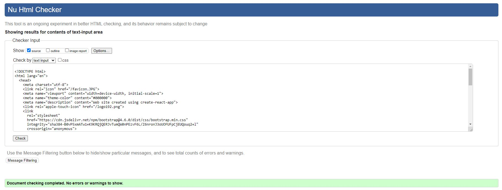
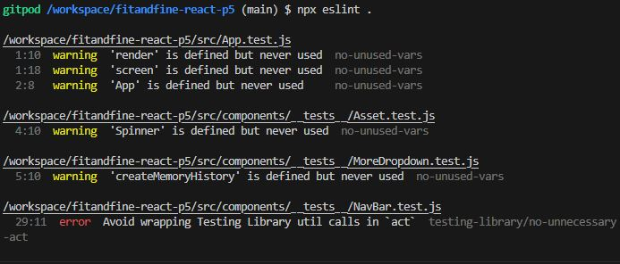
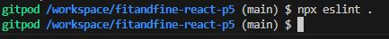
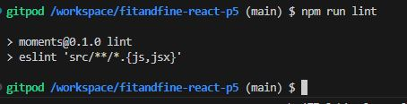
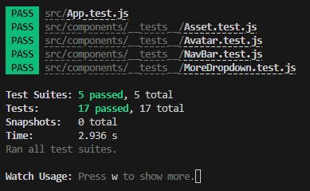
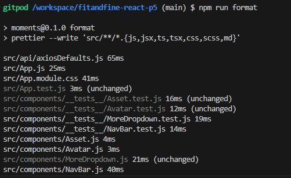
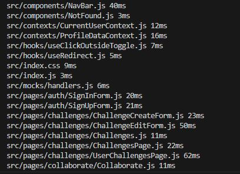
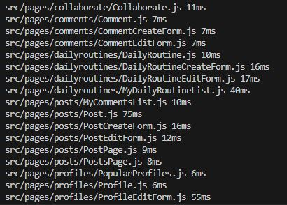
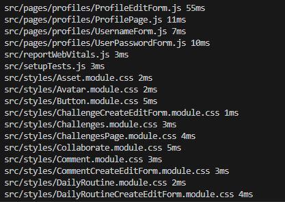
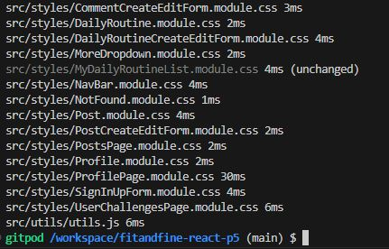

# Testing

This is the TESTING file for the [Fit&Fine](https://fitandfine-react-p5-f5d23da9d77c.herokuapp.com/) website.

Return back to the [README.md](README.md) file.

# Table of Contents
- [Testing](#testing)
- [Table of Contents](#table-of-contents)
  - [Validation](#validation)
    - [HTML Validation](#html-validation)
    - [CSS Validation](#css-validation)
    - [JavaScript Validation](#javascript-validation)
      - [ESLint](#eslint)
      - [Steps to Run JavaScript Validation](#steps-to-run-javascript-validation)
      - [Prettier for Code Formatting](#prettier-for-code-formatting)

## Validation 

To ensure the reliability, usability, and accessibility of Fit&Fine, various validation methodologies were implemented. These validations ensure that the application not only meets development standards but also provides a seamless user experience across different platforms and browsers. Below is an overview of the validation processes:

### HTML Validation
- **Tool Used:** [HTML W3C Markup Validator](https://validator.w3.org/)
- **Purpose:** Validates the HTML code of the application to ensure it is free from syntax errors and adheres to the standards set by the World Wide Web Consortium (W3C).
- **Process:** All HTML pages of Fit&Fine are checked through the W3C validator to identify and fix any markup errors or warnings.
- Validatuion results with zero errors and warnings in **index.html**.



### CSS Validation
- **Tool Used:** [W3C CSS Validation Service](https://jigsaw.w3.org/css-validator/)
- **Purpose:** Ensures the CSS code is compliant with W3C standards, free from syntax errors, and follows best practices for styling.
- **Process:** All CSS files are validated through the W3C CSS Validation Service to identify and rectify any issues.


**There were '0' errors and '0' warnings on all other module.css files, except few warnings in index.css and App.module.css which are explained below.**

**CSS Warnings**
This project includes custom styles that make use of vendor-specific extensions and pseudo-elements to ensure a consistent and polished user experience across various browsers and operating systems. During the linting process, certain warnings may appear, indicating the use of these vendor-specific extensions. These warnings are expected and can be safely ignored.

The following vendor-specific extensions and pseudo-elements are used in the project:

1. **Font and Font Smoothing:**
   - `-apple-system,BlinkMacSystemFont,'Segoe UI','Roboto','Oxygen','Ubuntu','Cantarell','Fira Sans','Droid Sans','Helvetica Neue',sans-serif`
   - `-webkit-font-smoothing`
   - `-moz-osx-font-smoothing`

2. **Custom Scrollbar Styles for WebKit Browsers:**
   - `::-webkit-scrollbar`
   - `::-webkit-scrollbar-track`
   - `::-webkit-scrollbar-thumb`

These styles are essential for ensuring optimal font rendering and custom scrollbar appearance, particularly in WebKit-based browsers (such as Chrome and Safari).

### JavaScript Validation

#### ESLint

**Tool Used:** [ESLint](https://eslint.org/)

**Purpose:** To detect errors and potential problems in the JavaScript code, ensuring that all scripts run efficiently and are error-free. ESLint helps enforce consistent coding styles and best practices by identifying and fixing problematic patterns in JavaScript code.

**Process:** JavaScript code is run through ESLint to identify issues related to syntax, deprecated methods, and other inefficiencies. The validation steps include running `npm test`, `npx eslint .`, and `npm run lint`.

#### Steps to Run JavaScript Validation

1. **Install Dependencies:**
   Ensure all required packages are installed by running:
   ```sh
   npm install
   ```

2. **Run ESLint:**
   To run ESLint across the project and identify any issues, use:
   ```sh
   npx eslint .
   ```
   
   

3. **Run Lint Script:**
   To run the lint script defined in `package.json`, use:
   ```sh
   npm run lint
   ```
   
   
   

4. **Run Tests:**
   To ensure all tests are passing and there are no issues with the codebase, run:
   ```sh
   npm test
   ```
   

#### Prettier for Code Formatting

To maintain a consistent code style across the project, Prettier is used to automatically format code. Run the following command to format all code files:

```sh
npm run format
```





