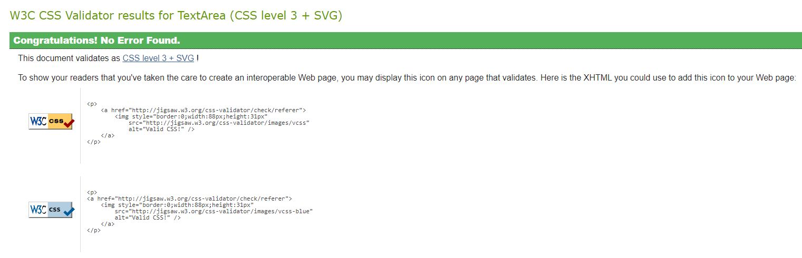
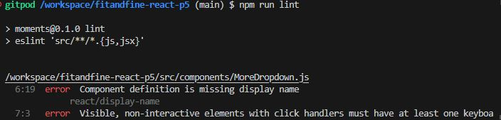
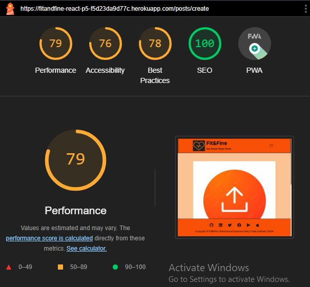
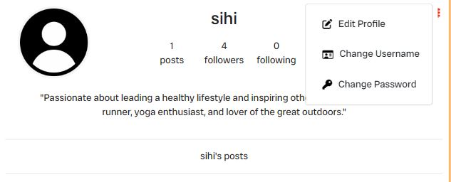
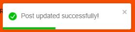
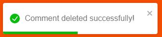
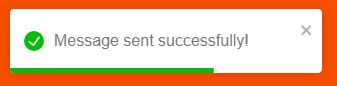

# Testing

This is the TESTING file for the [Fit&Fine](https://fitandfine-react-p5-f5d23da9d77c.herokuapp.com/) website.

Return back to the [README.md](README.md) file.

## Table of Contents
- [Testing](#testing)
  - [Table of Contents](#table-of-contents)
  - [Validation](#validation)
    - [HTML Validation](#html-validation)
    - [CSS Validation](#css-validation)
    - [JavaScript Validation](#javascript-validation)
      - [ESLint](#eslint)
      - [Steps to Run JavaScript Validation](#steps-to-run-javascript-validation)
      - [Prettier for Code Formatting](#prettier-for-code-formatting)
    - [Lighthouse](#lighthouse)
    - [Wave Accessibility Evaluation](#wave-accessibility-evaluation)
  - [Manual Testing](#manual-testing)
    - [User Input/Form Validation](#user-inputform-validation)
    - [Browser Compatibility](#browser-compatibility)
    - [Toastify Messages Implementation Testing](#toastify-messages-implementation-testing)
    - [Responsiveness](#responsiveness)
  - [Automated Testing](#automated-testing)
    - [Tools Used](#tools-used)
    - [Running Tests](#running-tests)
  - [Bugs](#bugs)
    - [Solved Bugs](#solved-bugs)
    - [Known Bugs](#known-bugs)
    - [Unknown Bugs](#unknown-bugs)

## Validation 

To ensure the reliability, usability, and accessibility of Fit&Fine, various validation methodologies were implemented. These validations ensure that the application not only meets development standards but also provides a seamless user experience across different platforms and browsers. Below is an overview of the validation processes:

### HTML Validation
- **Tool Used:** [HTML W3C Markup Validator](https://validator.w3.org/)
- **Purpose:** Validates the HTML code of the application to ensure it is free from syntax errors and adheres to the standards set by the World Wide Web Consortium (W3C).
- **Process:** All HTML pages of Fit&Fine are checked through the W3C validator to identify and fix any markup errors or warnings.
- Validatuion results with zero errors and warnings in **index.html**.


### CSS Validation
- **Tool Used:** [W3C CSS Validation Service](https://jigsaw.w3.org/css-validator/)
- **Purpose:** Ensures the CSS code is compliant with W3C standards, free from syntax errors, and follows best practices for styling.
- **Process:** All CSS files are validated through the W3C CSS Validation Service to identify and rectify any issues.



**There were '0' errors and '0' warnings on all other module.css files, except few warnings in index.css and App.module.css which are explained below.**

**CSS Warnings**
This project includes custom styles that make use of vendor-specific extensions and pseudo-elements to ensure a consistent and polished user experience across various browsers and operating systems. During the linting process, certain warnings may appear, indicating the use of these vendor-specific extensions. These warnings are expected and can be safely ignored.

The following vendor-specific extensions and pseudo-elements are used in the project:

1. **Font and Font Smoothing:**
   - `-apple-system,BlinkMacSystemFont,'Segoe UI','Roboto','Oxygen','Ubuntu','Cantarell','Fira Sans','Droid Sans','Helvetica Neue',sans-serif`
   - `-webkit-font-smoothing`
   - `-moz-osx-font-smoothing`

2. **Custom Scrollbar Styles for WebKit Browsers:**
   - `::-webkit-scrollbar`
   - `::-webkit-scrollbar-track`
   - `::-webkit-scrollbar-thumb`

These styles are essential for ensuring optimal font rendering and custom scrollbar appearance, particularly in WebKit-based browsers (such as Chrome and Safari).

### JavaScript Validation

#### ESLint

**Tool Used:** [ESLint](https://eslint.org/)

**Purpose:** To detect errors and potential problems in the JavaScript code, ensuring that all scripts run efficiently and are error-free. ESLint helps enforce consistent coding styles and best practices by identifying and fixing problematic patterns in JavaScript code.

**Process:** JavaScript code is run through ESLint to identify issues related to syntax, deprecated methods, and other inefficiencies. The validation steps include running `npm test`, `npx eslint .`, and `npm run lint`.

#### Steps to Run JavaScript Validation

1. **Install Dependencies:**
   Ensure all required packages are installed by running:
   ```sh
   npm install
   ```

2. **Run ESLint:**
   To run ESLint across the project and identify any issues, use:
   ```sh
   npx eslint .
   ```
   
   

3. **Run Lint Script:**
   To run the lint script defined in `package.json`, use:
   ```sh
   npm run lint
   ```
   
   
   

4. **Run Tests:**
   To ensure all tests are passing and there are no issues with the codebase, run:
   ```sh
   npm test
   ```
   

#### Prettier for Code Formatting

To maintain a consistent code style across the project, Prettier is used to automatically format code. Run the following command to format all code files:

```sh
npm run format
```


### Lighthouse
- **Tool Used:** [Google Lighthouse](https://en.wikipedia.org/wiki/Google_Lighthouse)
- **Purpose:** To assess the quality of web pages in terms of performance, accessibility, progressive web apps, SEO, and best practices.
- **Process:** Fit&Fine is tested with Google Lighthouse, which provides a detailed report on various aspects of the site’s performance and offers recommendations for improvement.

| HTML Page / Source           |     Lighthouse Report Screenshot     | 
|------------------------------|--------------------------------------|
| **Home Page**                |  |  
| **Collaborate Page**     |  | 
| **Challenges Page**          |  |
| **Add Post Page**      |  | 
| **Add Challenge Page**            |  | 
| **Add DailyRoutine Page**               |  | 
| **Sigin Page**              |  | 
| **Signup Page**              |  |
| **Profile Page**         |  | 
| **My Likes Page**           |  | 
| **My Feeds Page**        |  | 
| **My Comments Page**            |  |  
| **My Daily Routine Page**            |  | 

I have converted few images to webp and Even after compressing the images, could not increase the performance scores.

### Wave Accessibility Evaluation
- **Tool Used:** [Wave Web Accessibility Evaluation Tool](https://wave.webaim.org/)
- **Purpose:** To ensure that the website is accessible to individuals with disabilities by identifying and suggesting fixes for web accessibility issues.
- **Process:** The Wave tool evaluates each page of Fit&Fine to ensure it complies with accessibility standards like WCAG and Section 508.


## Manual Testing

### User Input/Form Validation

Thorough testing was conducted on all forms throughout Fit&Fine to ensure accurate user input validation and to provide necessary feedback.

**Form Validation**

| Feature             | Tested? | Action        | Expected Outcome | Pass/Fail | Screenshots |
|---------------------|---------|---------------|------------------|-----------|-------------|
| SignUp Form   | Yes     | Submit form   | User receives confirmation message and is redirected to the Home page | Pass      |       |
| SignIn Form          | Yes     | Submit credentials | User is logged in and redirected to the Home page | Pass      |        |
| Profile Edit Form       | Yes     | Profile Edit   | Profile is edited and displayed | Pass      |        |
| Add Post Form       | Yes     | Create post   | Post is created and displayed | Pass      |      |
| Add Daily Routine Form  | Yes     | Create dailyroutine   | Routine is created and added to user's daily routines | Pass      |      |
| Comment Form        | Yes     | Submit comment | Comment is added to the post | Pass      |      |
| Challenge Creation Form | Yes  | Create challenge | Challenge is created and listed | Pass      |      |
| Collaborate Form        | Yes     | Submit form   | User receives confirmation message  | Pass      |      |

**User Input**

| Feature                               | Tested? | User Input Required           | User Feedback Provided                                                          | Pass/Fail | Notes on Fix (If Any) |
|---------------------------------------|---------|------------------------------|--------------------------------------------------------------------------------|-----------|----------------------|
| Navigation Links                      | Yes     | Click                        | Links redirect to corresponding pages. Hover effects indicate interactivity.    | Pass      | -                    |
| Home Page                       | Yes     | Click                        | Clicking on posts takes users to detailed views. | Pass      | -                    |
| Sign Up Page                          | Yes     | Username/Password/Confirm password     | Validation prompts for incorrect input. Success message on account creation.    | Pass      | -                    |
| Sign In Page                            | Yes     | Username and Password        | Correct credentials required for login. Error message for failed login attempt. | Pass      | -                    |
| Add Post and Submission               | Yes     | Text/Image Upload  | Mandatory fields checked. Confirmation message upon successful submission.       | Pass      | -                    |
| Add Challenge and Submission         | Yes     | Text/Image Upload  | Mandatory fields checked. Confirmation message upon successful submission.       | Pass      | -                    |
| Add Daily Routine                    | Yes     | Text Input/Time Input | All fields validated for correct input. Confirmation message upon successful submission. | Pass      | -                    |
| Edit Profile                         | Yes     | Text/Image Upload  | Changes saved and confirmation message displayed. Updated profile information shown. | Pass      | -                    |
| Comment Submission                    | Yes     | Text Input                   | Users can submit comments. Confirmation message displayed.                     | Pass      | -                    |
| Like/Follow Interaction             | Yes     | Click                        | Visual feedback on like/follow. Counts update accordingly.                    | Pass      | -                    |
| Search & Filter functionality                  | Yes     | Text Input/Click                   | Relevant search results displayed. Message for no results found.                 | Pass      | -                    |
| Collaborate Form Submission            | Yes     | Text Input                   | Contact details of the user are submitted. Confirmation message displayed.      | Pass      | -                    |
| Post Detail Interaction               | Yes     | Click on various elements    | Detailed view of post with comments and like/follow options.                  | Pass      | -                    |
| Mobile Navigation (Hamburger Menu)    | Yes     | Touch/Click                  | Responsive menu works on touch devices. Toggles correctly.                       | Pass      | -                    |
| Form Error Handling                   | Yes     | Invalid Inputs               | Forms handle errors with descriptive messages guiding the user.                  | Pass      | -                    |
| Logout Functionality                  | Yes     | Click                        | Users can log out successfully with a confirmation message.                      | Pass      | -                    |
| Footer Social Media Icons             | Yes     | Click                        | Social media icons link to external pages in a new tab.                          | Pass      | -                    |
| Responsive Design Elements            | Yes     | Resize/Change Orientation    | All elements resize and adjust appropriately for different screen sizes.         | Pass      | -                    |
| Accessibility Features (e.g., ARIA)   | Yes     | Use of assistive technology  | ARIA labels and roles are present, ensuring accessibility compliance.            | Pass      | -                    |

### Browser Compatibility

Fit&Fine was tested on the latest versions of major browsers to ensure compatibility across different platforms.

| Browser              | Tested? | Issues Found | Pass/Fail |
|----------------------|---------|--------------|-----------|
| Chrome               | Yes     | None         | Pass      |
| Firefox              | Yes     | None         | Pass      |
| Microsoft Edge       | Yes     | None         | Pass      |

These validation steps confirm that Fit&Fine provides a seamless and accessible user experience across various devices and browsers.

### Toastify Messages Implementation Testing

This table documents the Toastify messages used throughout the Fit&Fine website to provide feedback to users after certain actions have been performed.

| Action Performed                      | Message Type | Message Text                                          | Implementation Location         |  Screenshots           |
|---------------------------------------|--------------|------------------------------------------------------|---------------------------------|---------|
| SignUp Success | Success   | "Successfully signed in." | After user form submission      |    |
| Login Success  | Success      | "Logged in successfully."  | After user authentication       |    |
| Logout Action  | Success      | "Successfully logged out!"   | After user clicks logout        |     |
| Post Submission Success            | Success      | "Your post has been submitted for review."         | After submitting a post form|     |
| Post Updated            | Success      | "Your post has been updated"."         | After editing a post |   |
| Post Deletion Confirmation           | Success      | "Your post has been deleted."                      | After deleting a post           |   |
| Comment           | Success      | "Your comment has been posted."| After submitting a comment     |    |
| Comment Updated                        | Success      | "Your comment has been updated."| After updating a comment     |     |
| Comment Deleted                         | Success      | "Your comment has been deleted."| After deleting a comment     |      |
| Followed   | Info         | "Followed successfully."         | When a user is followed       |      |
| Unfollowed        | Info         |    "Unfollowed successfully"   |  "When a user is unfollowed."       |     |
| Collaborate       | Info     | "Collaboration form submitted successfully!"       | When details are submitted.       |  |
| Challenge Join Success                 | Success      | "You have joined the challenge!"          | After joining a challenge            |     |
| Challenge Leave Success                 | Success      | "You have left the challenge!"          | After leaving a challenge            |     |
| Challenge Created                     | Success      | "Challenge created successfully!"                    | After creating a challenge      |  |
| Challenge Updated                     | Success      | "Challenge updated successfully!"                    | After updating a challenge      |  |
| Challenge Deleted                     | Success      | "Challenge deleted successfully!"                    | After deleting a challenge      |   |
| Daily Routine Created                 | Success      | "Daily routine created successfully!"                | After creating a daily routine  |  |
| Daily Routine Updated                 | Success      | "Daily routine updated successfully!"                | After updating a daily routine  |  |
| Daily Routine Deleted                 | Success      | "Daily routine deleted successfully!"                | After deleting a daily routine  |   |

### Responsiveness

Responsiveness and interactive elements were thoroughly tested on various devices and through browser developer tools to ensure a seamless user experience across different platforms and screen sizes.

| Device/Method           | Features Tested |
|-------------------------|-----------------|
| Chrome DevTools         | All            |
| Firefox Responsive Mode | All          |
| iPhone 13          | Navigation, forms, posts |
| Tab               | Few |
| Real Android Device     |All  |

**Identified Issue**
**Add Post Page:** On some devices, the add post page did not display correctly. 

## Automated Testing

### Tools Used
- **Jest**: A JavaScript testing framework for creating and running tests.
- **React Testing Library**: A set of helpers that let you test React components without relying on their implementation details.

**Key Areas Tested:**
- **Component Rendering**: Ensure all components render as expected.
- **User Interactions**: Verify interactions like button clicks, form submissions, and navigation.
- **Form Validations**: Check that form inputs are validated correctly and error messages are displayed as needed.

### Running Tests

1. **Install the dependencies:**
   ```sh
   npm install
   ```

2. **Run the tests:**
   ```sh
   npm test
   ```


## Bugs

### Solved Bugs

1. **Incorrect Display of Joined Date**
   - **Issue:** The joined date for challenges was incorrectly displayed or not formatted properly.
   - **Solution:** Implemented proper date formatting using `toLocaleDateString` to ensure the joined date was displayed in "dd-mm-yyyy" format.
   - **Reference:** [JavaScript Date toLocaleDateString Documentation](https://developer.mozilla.org/en-US/docs/Web/JavaScript/Reference/Global_Objects/Date/toLocaleDateString)

2. **Navigation Bar Toggle Issue on Mobile Devices**
   - **Issue:** The navigation bar toggle was not working correctly on some mobile devices.
   - **Solution:** Updated the React Bootstrap NavBar component to ensure the toggle functioned properly across all screen sizes.
   - **Reference:** [React Bootstrap NavBar Documentation](https://react-bootstrap.github.io/docs/components/navbar)

3. **Dynamic Filtering of Challenges**
   - **Issue:** Filtering challenges by sport was not dynamically updating the displayed list.
   - **Solution:** Implemented state management using React hooks to ensure the filtered list updated correctly based on user selection.
   - **Reference:** [React Hooks Documentation](https://reactjs.org/docs/hooks-intro.html)

4. **Form Submission Validation for Daily Routines**
   - **Issue:** Users were able to submit daily routines with future dates and unrealistic water intake values.
   - **Solution:** Added custom validation in the Django serializers to ensure dates were not in the future and water intake was within a realistic range.
   - **Reference:** [Django Serializers Documentation](https://www.django-rest-framework.org/api-guide/serializers/)

5. **Image Upload Errors**
   - **Issue:** Users encountered errors when uploading images, especially when the images exceeded the maximum file size.
   - **Solution:** Integrated file size validation and compression before uploading images to Cloudinary, and provided user feedback on file size issues.
   - **Reference:** [Cloudinary Documentation on Image Uploads](https://cloudinary.com/documentation/image_upload_api)

6. **Navigation Bar Update Issues**
   - **Issue:** The navigation bar did not update dynamically to reflect the user's authentication status.
   - **Solution:** Utilized React's context API to manage global state, ensuring the navigation bar updates in real-time when the user's authentication status changes.
   - **Reference:** [React Context API Documentation](https://reactjs.org/docs/context.html)

7. **Challenges Filtering by Sport**
   - **Issue:** Users were unable to filter challenges by specific sports effectively.
   - **Solution:** Added filter functionality to the challenges API and implemented corresponding frontend filters to allow users to select and view challenges based on specific sports.
   - **Reference:** [Django QuerySet API](https://docs.djangoproject.com/en/3.2/ref/models/querysets/)
  
8. **Improving Button Layout**

   - **Issue:** Buttons on the Challenges page were overlapping, making them difficult to interact with.
   - **Solution:** Updated the CSS styles to ensure buttons are spaced properly and do not overlap.
   - **Reference:** [CSS Flexbox Documentation](https://css-tricks.com/snippets/css/a-guide-to-flexbox/)

### Known Bugs

1. **Add Post Page Responsiveness**
   - The Add Post page does not appear responsive on some devices.

2. **Intermittent Login Issues**
   - Some users experience intermittent issues while logging in, where the login button becomes unresponsive.

3. **Slow Load Times on Initial Page Load**
   - The initial page load time is slower than expected, particularly on the home page with many posts.

### Unknown Bugs

There may be other bugs that have not yet been identified.
